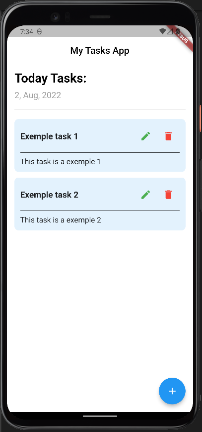
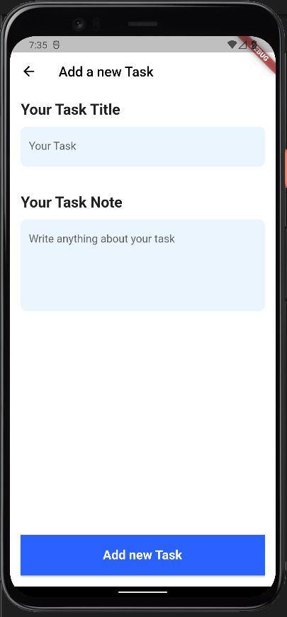

# Crud with Flutter and Hive

A Tasks project made with flutter and usage a Hive local database.

## Home Page screen





## Create Task screen



## Packages usage

* Hive
* Hive_flutter
* Path_provider

Add this packages in your Flutter file pubspec.yaml and run 

```
flutter pub get

```

## Base Application

This application is based a Youtube tutorial
Link: https://youtu.be/Tv3E29870ak

